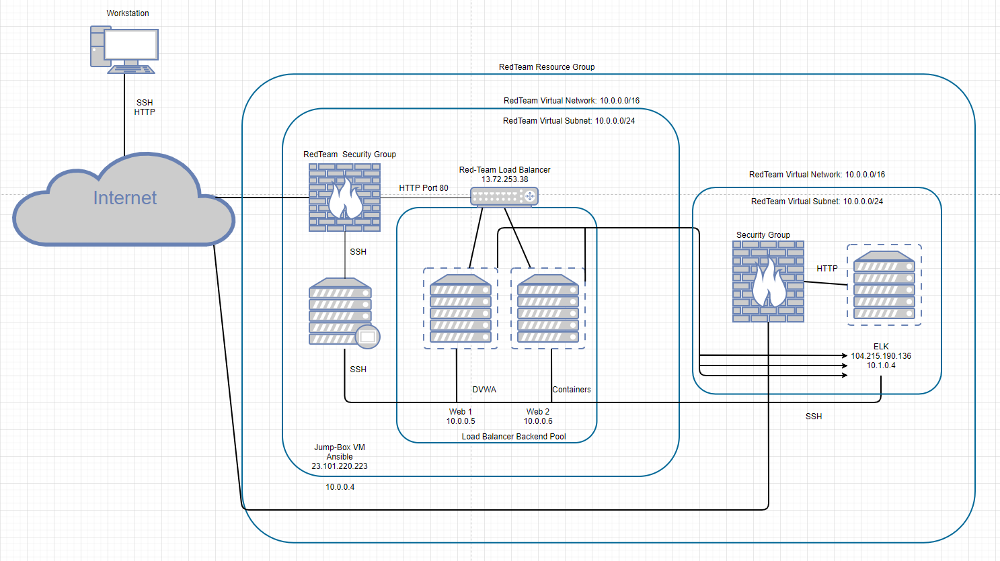
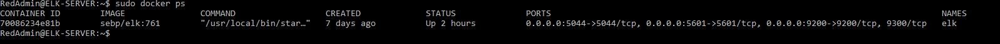

## Automated ELK Stack Deployment

The files in this repository were used to configure the network depicted below.

These files have been tested and used to generate a live ELK deployment on Azure. They can be used to either recreate the entire deployment pictured above. Alternatively, select portions of the YAML file may be used to install only certain pieces of it, such as Filebeat.

This document contains the following details:
- Description of the Topologu
- Access Policies
- ELK Configuration
  - Beats in Use
  - Machines Being Monitored
- How to Use the Ansible Build

### Description of the Topology

The main purpose of this network is to expose a load-balanced and monitored instance of DVWA, the D*mn Vulnerable Web Application.

Load balancing ensures that the application will be highly available, in addition to restricting traffic to the network.

-What aspect of security do load balancers protect? The off-loading function of a load balancer defends an organization against distributed denial-of-service (DDoS) attacks. ---

-What is the advantage of a jump box? Jump box secure ssh access and manage the Linux servers and cloud containers, it act like a proxy server.

Integrating an ELK server allows users to easily monitor the vulnerable VMs for changes to the applications and system infrastructure.

-What does Filebeat watch for? Filebeat monitors the log files or locations that I specify, which is web-1 and web-2.

-What does Metricbeat record? Metricbeat collect metrics from the operating system and from services running on the server.

The configuration details of each machine may be found below.
_Note: Use the [Markdown Table Generator](http://www.tablesgenerator.com/markdown_tables) to add/remove values from the table_.

| Name     | Function | IP Address | Operating System |
|----------|----------|------------|------------------|
| Jump Box | Gateway  | 10.0.0.4   | Linux            |
| Web-1    | WebServer| 10.0.0.5   | Linux            |
| Web-2    |Containers| 10.0.0.6   | Linux            |
| ELK      | Monitor  | 10.1.0.4   | Linux            |

### Access Policies

The machines on the internal network are not exposed to the public Internet. 

Only the Gateway machine can accept connections from the Internet. Access to this machine is only allowed from the following IP addresses:

-whitelisted IP addresses: 23.101.220.223

Machines within the network can only be accessed by Jump box.

-Which machine did you allow to access your ELK VM? Jump box. 

-What was its IP address? 10.0.0.4

A summary of the access policies in place can be found in the table below.

| Name      | Publicly Accessible | Allowed IP Addresses    |
|-----------|---------------------|-------------------------|
| Jump Box  | Yes                 | 121.200.6.47            |
| ELK       | Yes & No            | 121.200.6.47 & 10.0.0.4 |
|Web-1(DVWA)| Yes & No            | 121.200.6.47 & 10.0.0.4 |
|  Web-2    | No                  | 10.0.0.4                |

### Elk Configuration

Ansible was used to automate configuration of the ELK machine. No configuration was performed manually, which is advantageous because...
-What is the main advantage of automating configuration with Ansible? Allows IT administrators to automate away the drudgery from their daily tasks, which frees them to focus on efforts that help deliver more value to the business by spending time on more important tasks.

The playbook implements the following tasks:
In 3-5 bullets, explain the steps of the ELK installation play. E.g., install Docker; download image; etc._

-Install docker:The Docker engine, used for running containers.

-Install python3-pip: Package used to install Python software.

-Install docker module: Python client for Docker. Required by Ansbile to control the state of Docker containers.

-Download and launch docker elk container: Downloads the Docker container called sebp/elk:761 . sebp is the organization that made the container. elk is the container and 761 is  the version.

-Configures the container to start with the following port mappings: 5601:5601, 9200:9200, 5044:5044.

The following screenshot displays the result of running `docker ps` after successfully configuring the ELK instance.

### Target Machines & Beats
This ELK server is configured to monitor the following machines:
-List the IP addresses of the machines you are monitoring. 10.0.0.5 and 10.0.0.6.

We have installed the following Beats on these machines:
- _TODO: Specify which Beats you successfully installed_

These Beats allow us to collect the following information from each machine:
- _TODO: In 1-2 sentences, explain what kind of data each beat collects, and provide 1 example of what you expect to see. E.g., `Winlogbeat` collects Windows logs, which we use to track user logon events, etc._

### Using the Playbook
In order to use the playbook, you will need to have an Ansible control node already configured. Assuming you have such a control node provisioned: 

SSH into the control node and follow the steps below:
- Copy the filebeat-install.yml file to /etc/ansible/roles.
- Update the filebeat-config.yml file to include the host detail like IP address.
- Run the playbook, and navigate to http://104.215.190.136:5601/ to check that the installation worked as expected.

_As a **Bonus**, provide the specific commands the user will need to run to download the playbook, update the files, etc._
Command for playbook:
Run: ansible-playbook filebeat-install.yml
Download:
Update the files: nano fielbeat-install.yml
